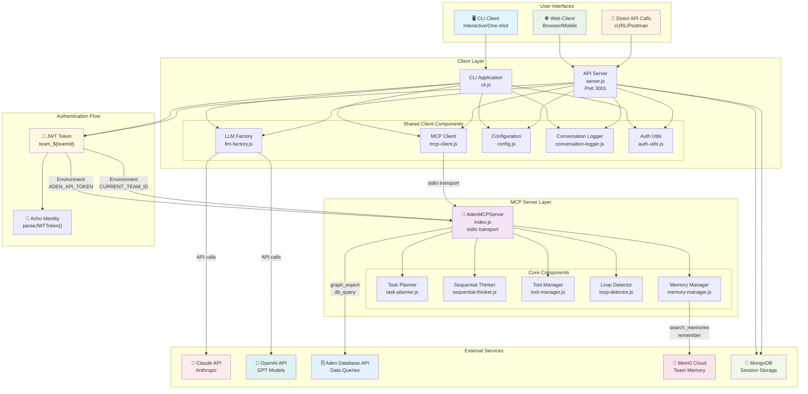
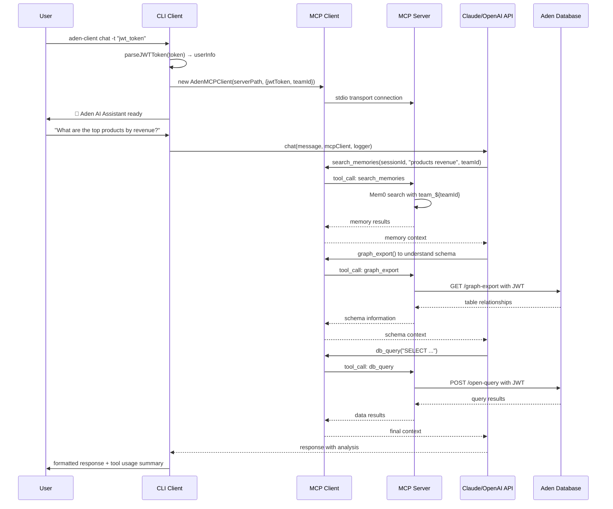
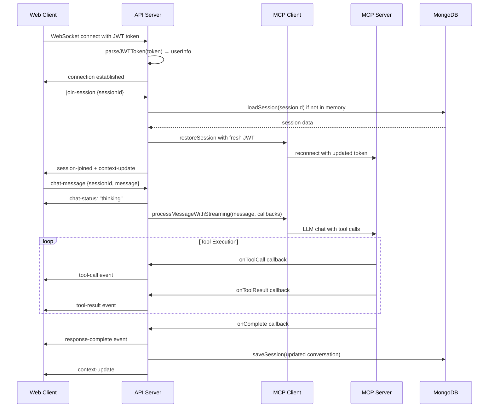
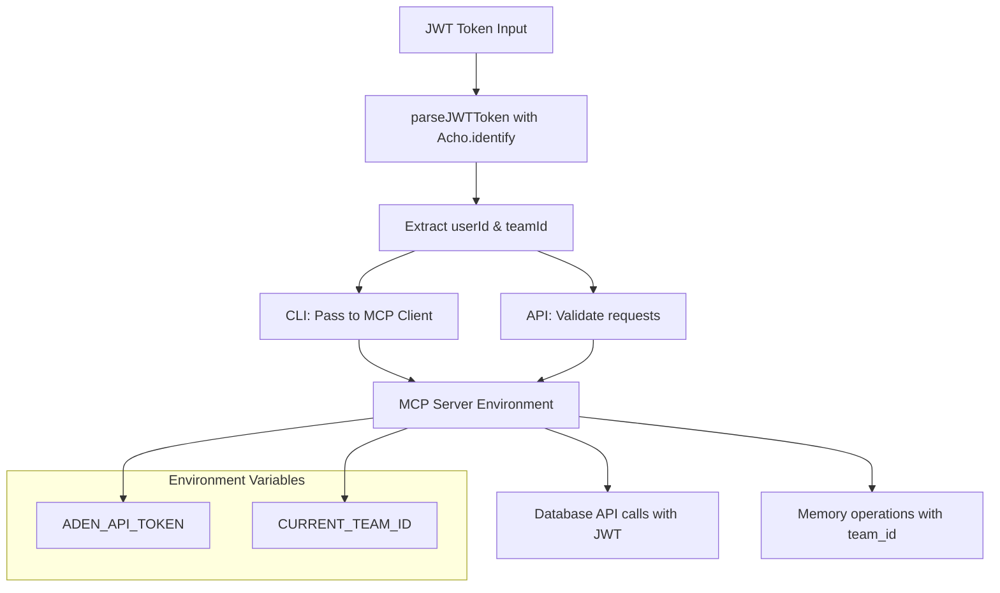

# Aden MCP Architecture Documentation

## Overview

The Aden MCP system is an AI-powered sequential thinking and task planning platform built on the Model Context Protocol (MCP) standard. The architecture consists of three main components:

1. **MCP Server** (`src/index.js`) - Core MCP-compliant server exposing tools via stdio
2. **CLI Client** (`client/src/cli.js`) - Command-line interface for local interactions
3. **API Server** (`api-server/src/server.js`) - HTTP/WebSocket API for web applications

## Architecture Diagram



## Component Details

### 1. MCP Server (`src/index.js`)

**Role**: Core MCP-compliant server that exposes AI tools via stdio transport

**Key Features**:

- **Sequential Thinking**: 5-phase structured problem solving
- **Task Planning**: Intelligent task breakdown with dependency management
- **Tool Management**: Extensible framework for built-in and custom tools
- **Memory Integration**: Team-scoped memory via Mem0 cloud service
- **Database Access**: Query Aden database with `graph_export` and `db_query` tools
- **Loop Detection**: Prevents infinite task execution cycles

**Environment Variables**:

- `ADEN_API_TOKEN`: JWT token for database access
- `CURRENT_TEAM_ID`: Team identifier for memory scoping
- `MEM0_API_KEY`: Mem0 cloud service API key
- `ADEN_HOST`: Base URL for Aden API

**Exposed Tools**:

- `think_sequentially(problem)` - Sequential analysis
- `plan_tasks(objective)` - Task planning
- `execute_task(taskId)` - Task execution with loop monitoring
- `search_memories(sessionId, query, limit)` - Team memory search
- `remember(sessionId, content, category, confidence)` - Store team insights
- `db_query(query, params, limit)` - Database queries
- `graph_export(tableName, depth, format)` - Schema export

### 2. CLI Client (`client/src/cli.js`)

**Role**: Command-line interface for local interactions

**Key Features**:

- **Interactive Chat**: Real-time conversation with context awareness
- **One-shot Commands**: Direct queries without session state
- **Authentication**: JWT token management for team features
- **Session Management**: Conversation history and logging
- **Configuration**: LLM provider switching and settings

**Commands**:

- `aden-client chat` - Interactive chat session
- `aden-client ask "question"` - One-time query
- `aden-client think "problem"` - Sequential thinking analysis
- `aden-client plan "objective"` - Task planning
- `aden-client auth` - Configure authentication
- `aden-client config` - Interactive configuration

**Authentication Flow**:

1. JWT token input via CLI flag or interactive prompt
2. Token parsing with `parseJWTToken()` to extract `userId` and `teamId`
3. MCP client initialization with team context
4. Team-scoped memory operations

### 3. API Server (`api-server/src/server.js`)

**Role**: HTTP/WebSocket API server for web applications

**Key Features**:

- **RESTful API**: Session management and one-shot endpoints
- **WebSocket Support**: Real-time chat with streaming responses
- **Session Persistence**: MongoDB-backed session storage
- **Authentication**: JWT middleware for all endpoints
- **User Isolation**: Team-based access control

**HTTP Endpoints**:

- `POST /sessions` - Create new session
- `GET /sessions` - List user's sessions
- `POST /sessions/:id/chat` - Send message to session
- `GET /sessions/:id/history` - Get conversation history
- `POST /ask` - One-shot query
- `POST /think` - Sequential thinking
- `POST /plan` - Task planning

**WebSocket Events**:

- Client: `join-session`, `chat-message`, `command`
- Server: `tool-call`, `tool-result`, `response-chunk`, `response-complete`

**Session Management**:

- **In-Memory Cache**: Active sessions for fast access
- **MongoDB Persistence**: Long-term storage and restoration
- **Token Refresh**: Automatic JWT token updates for database access
- **Ownership Validation**: Ensure users can only access their sessions

## Data Flow Patterns

### CLI Chat Flow



### API Server WebSocket Flow



## Memory Architecture

### Team-Scoped Memory with Mem0

The system implements team-based memory isolation using Mem0 cloud service:

**Memory Scoping**:

- Each team gets a unique agent ID: `team_${teamId}`
- All memory operations are automatically scoped to the team
- Cross-team data isolation is enforced at the Mem0 level

**Memory Operations**:

- **Search**: `search_memories(sessionId, query, teamId, limit)`
- **Store**: `remember(sessionId, content, category, confidence)`

**Memory Categories**:

- `business_decision` - Strategic decisions and outcomes
- `user_preference` - User and team preferences
- `technical_insight` - Technical findings and solutions
- `project_update` - Project status and milestones
- `strategic_direction` - Long-term planning insights

## Authentication & Security

### JWT Token Flow



**Security Features**:

- JWT token validation without signature verification (external issuer)
- Team-based access control for all operations
- Session ownership validation
- Automatic token refresh for long-running sessions
- Environment variable isolation between teams

## Deployment Architectures

### Development (Local)

```
┌─────────────────┐    ┌─────────────────┐
│   CLI Client    │    │   API Server    │
│  (Terminal)     │    │ (localhost:3001)│
└─────────┬───────┘    └─────────┬───────┘
          │                      │
          └──────┬─────────┬─────┘
                 │         │
         ┌───────▼─────────▼───────┐
         │    MCP Server           │
         │   (stdio process)       │
         └─────────────────────────┘
```

### Production (Kubernetes)

```
┌─────────────────┐    ┌─────────────────┐
│  Web Frontend   │    │   Mobile App    │
│   (React/Vue)   │    │   (iOS/Android) │
└─────────┬───────┘    └─────────┬───────┘
          │                      │
          └──────┬─────────┬─────┘
                 │         │
         ┌───────▼─────────▼───────┐
         │   API Server Pod        │
         │ (LoadBalancer Service)  │
         │   ┌─────────────────┐   │
         │   │   MCP Server    │   │
         │   │ (child process) │   │
         │   └─────────────────┘   │
         └─────────────────────────┘
                      │
         ┌────────────▼────────────┐
         │     External APIs       │
         │ ┌─────┐ ┌─────┐ ┌─────┐ │
         │ │Claude│ │Aden │ │Mem0 │ │
         │ │ API │ │ DB  │ │Cloud│ │
         │ └─────┘ └─────┘ └─────┘ │
         └─────────────────────────┘
```

## Key Design Patterns

### 1. MCP Protocol Compliance

- **Tool Registration**: All capabilities exposed as MCP tools
- **Stdio Transport**: Standard MCP communication protocol
- **Schema Validation**: Proper input/output schema definitions
- **Error Handling**: MCP-compliant error responses

### 2. Session Management

- **Stateless Server**: MCP server is stateless, clients manage sessions
- **Persistent Storage**: API server provides MongoDB-backed persistence
- **Token Refresh**: Automatic JWT token updates for database access
- **Graceful Recovery**: Sessions can be restored from storage

### 3. Memory Integration

- **Team Isolation**: All memory operations scoped by team
- **Explicit Control**: Claude decides what to remember using tools
- **Confidence Scoring**: Memory entries include confidence levels
- **Cross-Session Context**: Team memory spans all conversations

### 4. Error Handling & Resilience

- **Loop Detection**: Prevents infinite task cycles
- **Connection Recovery**: Automatic MCP client reconnection
- **Graceful Degradation**: Fallback when external services fail
- **Comprehensive Logging**: Detailed logging for debugging

## Configuration Management

### Environment Variables

**MCP Server**:

- `ADEN_API_TOKEN` - JWT token for database access
- `CURRENT_TEAM_ID` - Team identifier
- `MEM0_API_KEY` - Memory service API key
- `ADEN_HOST` - Aden API base URL

**Client Applications**:

- `ANTHROPIC_API_KEY` - Claude API access
- `OPENAI_API_KEY` - OpenAI API access
- `MONGODB_URL` - MongoDB connection string
- `PORT` - API server port (default: 3001)

### Configuration Files

**Client Config** (`client/config/config.json`):

```json
{
  "llm": {
    "provider": "claude",
    "claude": {
      "model": "claude-3-5-sonnet-20241022",
      "maxTokens": 8192,
      "temperature": 0.1
    }
  },
  "mcp": {
    "serverPath": "../src/index.js"
  }
}
```

## Performance Considerations

### Scalability

- **Horizontal Scaling**: API server can be scaled across multiple pods
- **Session Distribution**: MongoDB provides shared session state
- **Connection Pooling**: Database connections are pooled
- **Memory Efficiency**: In-memory session cache with MongoDB persistence

### Monitoring

- **Health Endpoints**: Comprehensive health checks with metrics
- **Connection Tracking**: WebSocket connection monitoring
- **Performance Logging**: Response time and token usage tracking
- **Error Aggregation**: Structured error logging for analysis

### Optimization

- **Lazy Initialization**: Components initialized on demand
- **Connection Reuse**: MCP clients reused within sessions
- **Memory Management**: Automatic cleanup of inactive sessions
- **Caching Strategy**: Multi-level caching (memory + MongoDB)

This architecture provides a robust, scalable foundation for AI-powered conversations with enterprise-grade features including team isolation, persistent sessions, and comprehensive tool integration.
