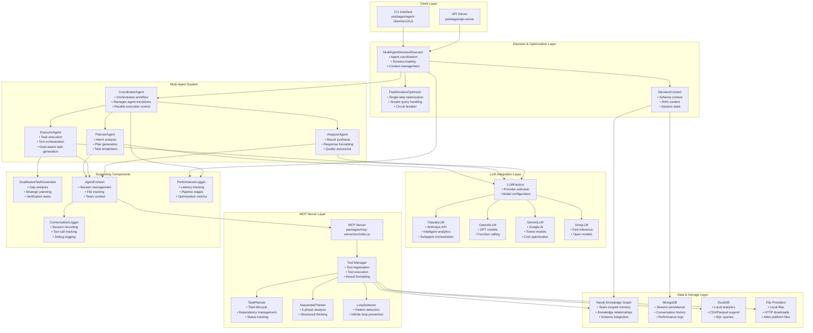
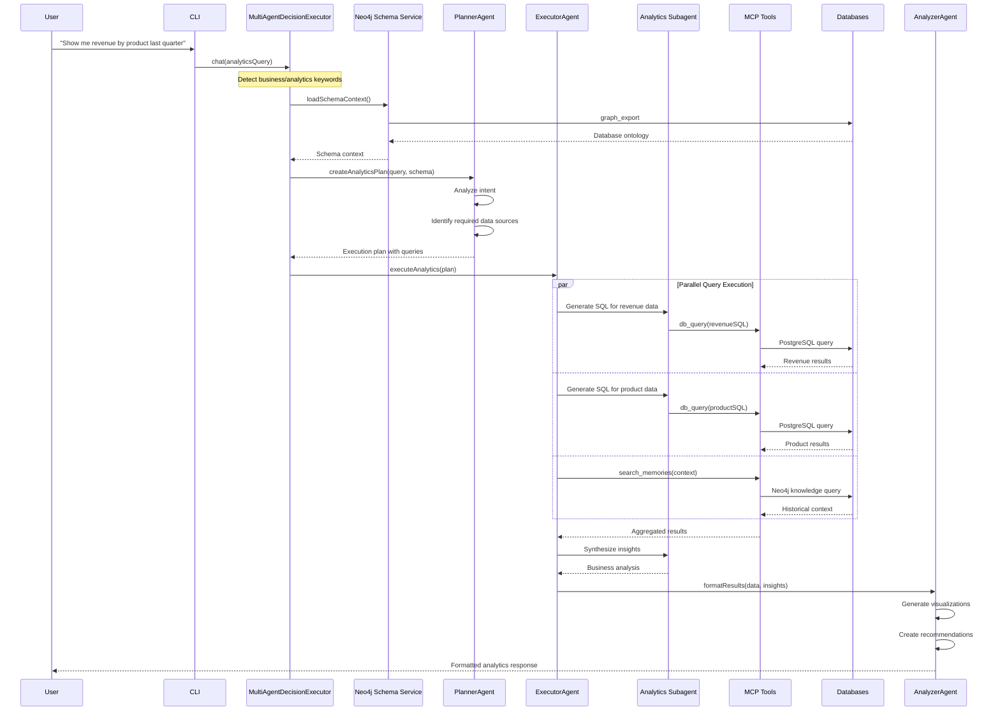
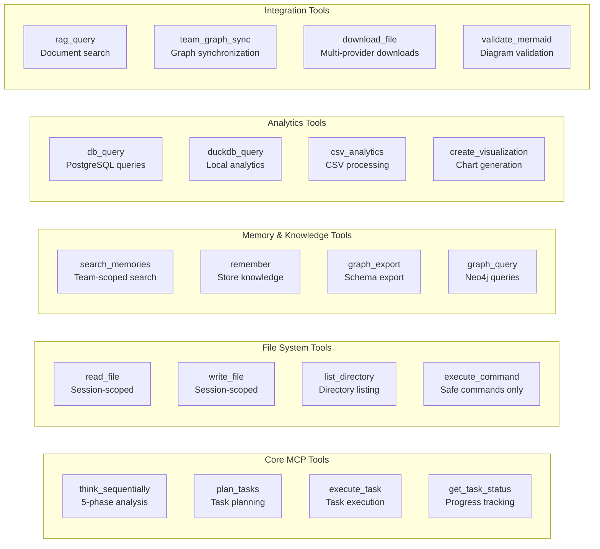
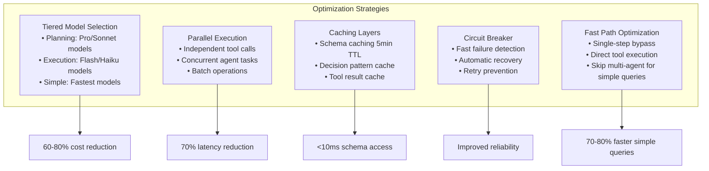

<div align="center">
  <a href="https://adenhq.com">
    
  </a>
  
  <h1>Aden MCP Analytics Framework</h1>
  
  <p><strong>Deep Database Intelligence via Model Context Protocol</strong></p>
  
  <p>
    <a href="https://github.com/acho-dev/aden/stargazers"></a>
    <a href="https://github.com/acho-dev/aden/network/members"></a>
    <a href="https://docs.adenhq.com/"></a>
    <a href="https://discord.gg/HqSUFbKkfk"></a>
    <a href="LICENSE"></a>
  </p>
  
  <p>
    <strong>By <a href="https://adenhq.com">Aden</a> - The AI Operation Hub</strong><br/>
    <em>Scale your business processes with AI-powered analytics</em>
  </p>
</div>

---

## 📌 About This Project

The **Aden MCP Analytics Framework** is an open-source initiative by [Aden](https://adenhq.com) to democratize data analytics through conversational AI. Built on the Model Context Protocol (MCP), this framework empowers developers to create AI agents that autonomously navigate databases, execute complex analytical queries, and deliver actionable business insights through natural language.

As part of Aden's mission to help companies **automate 90% of manual workflows**, this community project provides the foundational tools for building next-generation analytics applications.

## 🎯 Why Choose the Aden Framework?

### The Challenge

Modern businesses struggle with data trapped in silos across multiple databases, requiring technical expertise to extract insights. Traditional BI tools demand SQL knowledge, manual report building, and constant maintenance. Data teams are overwhelmed with ad-hoc requests while business users wait days for simple answers.

### The Aden Framework Solution

Built on the same technology powering [Aden's AI Operation Hub](https://adenhq.com), this framework transforms how organizations interact with their data through **conversational analytics powered by AI agents**. Instead of writing queries or building dashboards, users simply ask questions in natural language and receive instant, actionable insights.

> **💡 Did you know?** Aden helps organizations make critical decisions **3x faster** while reducing software costs through intelligent automation.

### What Makes Aden Different

#### 🧠 **True Database Intelligence**

Unlike chatbots that guess at queries, Aden's agents understand your actual database schema, relationships, and business context. They generate precise, optimized SQL that works the first time.

#### 🚀 **Zero Setup Analytics**

No need to define metrics, build data models, or create dashboards. Aden automatically discovers your data structure and begins delivering insights immediately.

#### 🔄 **Adaptive Learning**

Every interaction makes Aden smarter. The platform builds organizational knowledge graphs that capture business logic, metric definitions, and analytical patterns unique to your company.

#### 🏢 **Enterprise-Grade Architecture**

Built for scale with team-based isolation, JWT authentication, and comprehensive audit trails. Process millions of records with DuckDB's columnar engine while maintaining sub-second response times.

#### 🤝 **MCP-Native Integration**

First analytics platform built entirely on the Model Context Protocol, enabling seamless integration with any MCP-compatible tool or service. Extend functionality without touching core code.

### Real-World Impact

**For Business Users:**

- Get answers in seconds, not days
- No SQL or technical knowledge required
- Natural conversation with follow-up questions
- Automated insight discovery and recommendations

**For Data Teams:**

- Eliminate repetitive query requests
- Focus on strategic initiatives
- Automatic documentation of business logic
- Reusable knowledge that scales across teams

**For Organizations:**

- Democratize data access across all departments
- Reduce time-to-insight by 90%
- Build institutional knowledge automatically
- Ensure consistent, accurate analytics

## 🌟 Key Features

### Intelligent Database Analytics

- **Autonomous Query Generation**: AI agents automatically generate complex SQL queries based on natural language questions
- **Schema-Aware Intelligence**: Agents understand your database structure through graph_export and intelligently navigate relationships
- **Multi-Database Support**: Seamlessly query PostgreSQL, DuckDB, Neo4j, and MongoDB through unified MCP tools
- **Business Context Understanding**: Agents detect business keywords and automatically enrich queries with relevant context
- **Type-Safe Query Generation**: PostgreSQL queries with explicit type casting and proper JOIN operations

### Advanced Analytics Capabilities

- **Intelligent Subagent Orchestration**: Claude-powered subagents that understand business intent and generate follow-up queries
- **Real-time Data Exploration**: Interactive exploration of databases with instant visualization generation
- **Cross-Database Correlation**: Combine data from multiple sources for comprehensive analysis
- **Automated Insight Discovery**: Agents proactively identify patterns, anomalies, and actionable insights
- **CSV/Parquet Analytics**: Local file analysis with DuckDB for fast analytical processing

### Multi-Agent Analytics Architecture

- **PlannerAgent**: Analyzes data requests and creates analytical execution plans
- **ExecutorAgent**: Orchestrates database queries and data retrieval across multiple sources
- **AnalyzerAgent**: Synthesizes query results into business insights and recommendations
- **CoordinatorAgent**: Manages parallel query execution and result aggregation

### Enterprise Data Features

- **Team-Scoped Knowledge Graph**: Neo4j integration for organizational memory and context
- **Session Persistence**: MongoDB storage for conversation history and query patterns
- **Performance Optimization**: Query caching, parallel execution, and intelligent model selection
- **Secure Data Access**: JWT-based authentication with team-level data isolation

## 🚀 Quick Start

> **🏗️ Built by the Community, Powered by Aden**  
> This project is maintained by the Aden developer community. Join us on [Discord](https://discord.gg/aden) to contribute!

### Installation

### Prerequisites

- Node.js 18+
- npm or yarn
- Neo4j (optional, for knowledge graph features)
- MongoDB (optional, for session persistence)

### Setup

1. Clone the repository:

```bash
git clone https://github.com/YOUR_USERNAME/aden-mcp-agent.git
cd aden-mcp-agent
```

2. Install dependencies:

```bash
# Install server dependencies
cd packages/mcp-server
npm install

# Install client dependencies
cd ../agent-client
npm install
```

3. Configure environment variables:

```bash
# Create .env file in packages/mcp-server
cp .env.example .env

# Add your configuration:
ADEN_HOST=https://your-api-host.com
ADEN_API_TOKEN=your_jwt_token
NEO4J_URI=bolt://localhost:7687
NEO4J_PASSWORD=your_neo4j_password
OPENAI_API_KEY=your_openai_key  # For intelligent analytics
```

4. Start the MCP server:

```bash
cd packages/mcp-server
npm start
```

5. Use the client:

```bash
cd packages/agent-client
node src/cli.js chat
```

## 📖 Usage Examples

### Business Analytics Queries

```bash
# Start interactive analytics session
node src/cli.js chat

# Natural language database queries
> Show me revenue trends for Q4 2024 broken down by product category
> Which customers have the highest churn risk based on usage patterns?
> Analyze employee productivity metrics across departments
> Compare this month's sales performance to the same period last year
```

The analytics agent will:

1. Understand your business question
2. Automatically explore your database schema
3. Generate optimized SQL queries
4. Execute parallel data retrievals
5. Synthesize results into actionable insights
6. Generate visualizations when appropriate

### Advanced Analytics Examples

#### Revenue Analysis

```bash
> What's our ARR and how has it changed over the last 6 months?
# Agent will:
# - Query subscription data
# - Calculate Annual Recurring Revenue
# - Analyze month-over-month changes
# - Identify growth drivers
```

#### Customer Intelligence

```bash
> Find all enterprise customers who haven't engaged in 30 days
# Agent will:
# - Query customer segments
# - Analyze engagement metrics
# - JOIN with activity logs
# - Provide re-engagement recommendations
```

#### Operational Analytics

```bash
> Show me ticket resolution times by support agent this week
# Agent will:
# - Query ticket database
# - Calculate resolution metrics
# - Group by agent performance
# - Identify bottlenecks
```

### Authenticated Team Analytics

```bash
# Set up authentication for team-scoped data
node src/cli.js auth -t "your_jwt_token"

# Access team-specific analytics with context
node src/cli.js chat -t "your_jwt_token"
> Show me our team's project completion rate vs company average
```

## 🏗️ Architecture

### Analytics-First Architecture Overview

The Aden Analytics Agent System is designed from the ground up for intelligent database exploration and business analytics. At its core, the system transforms natural language questions into sophisticated multi-database queries, orchestrates parallel data retrieval, and synthesizes results into actionable business insights.

### High-Level System Architecture



### Analytics Query Flow



### Tool Ecosystem



### Performance Optimization Features



## 🔧 Core Analytics Components

### Intelligent Analytics Subagent (`/packages/agent-client/src/llm/claude-llm.js`)

The AI-powered database intelligence system that:

- Automatically detects business and analytics questions
- Generates schema-aware SQL queries
- Orchestrates multi-tool analytical workflows
- Synthesizes data into actionable insights

### MultiAgentDecisionExecutor (`/packages/agent-client/src/decision-executor/multi-agent-decision-executor.js`)

Advanced orchestration layer that:

- Routes analytics queries through specialized agents
- Manages parallel database connections
- Optimizes query execution paths
- Maintains session context and team isolation

### Neo4j Schema Service (`/packages/agent-client/src/decision-executor/neo4j-schema-service.js`)

Schema intelligence engine that:

- Exports database ontology in real-time
- Maps table relationships and foreign keys
- Provides column metadata and constraints
- Enables intelligent JOIN generation

### MCP Database Tools (`/packages/mcp-server/src/index.js`)

Comprehensive data access layer providing:

- `db_query`: PostgreSQL query execution with parameterization
- `duckdb_query`: Local analytics on CSV/Parquet files
- `graph_export`: Schema discovery and relationship mapping
- `search_memories`: Team knowledge retrieval from Neo4j

## 🧪 Testing

Run the test suite:

```bash
cd packages/agent-client
npm test

# Test goal-aware task generation specifically
node test/test-goal-aware-task-generation.js
```

## 🤝 Community & Contributing

<div align="center">
  <strong>Join the Aden Developer Community!</strong>
  
  [](https://discord.gg/aden)
  [](https://twitter.com/adenhq)
  [](https://github.com/acho-dev/aden/discussions)
</div>

We welcome contributions from developers worldwide! The Aden MCP Analytics Framework is a community-driven project, and we're excited to see what you'll build.

### How to Contribute

1. **Star the Repository** ⭐ - Show your support!
2. **Join our Discord** - Connect with other developers
3. **Report Issues** - Help us improve the framework
4. **Submit PRs** - Add features or fix bugs
5. **Share Your Projects** - Show us what you've built!

### Development Guidelines

```bash
# Fork and clone the repository
git clone https://github.com/YOUR_USERNAME/aden-mcp.git
cd aden-mcp

# Create a feature branch
git checkout -b feature/your-amazing-feature

# Make your changes and test
npm test

# Commit with conventional commits
git commit -m "feat: add new analytics capability"

# Push and create a PR
git push origin feature/your-amazing-feature
```

### Code of Conduct

We follow the [Aden Community Code of Conduct](https://github.com/acho-dev/aden/blob/main/CODE_OF_CONDUCT.md). Please be respectful and inclusive in all interactions.

## 🗺️ Roadmap

We're building the future of conversational analytics together! Here's what's coming:

### Q3 2025

- [ ] **Advanced Visualizations** - D3.js and Plotly integration
- [ ] **Custom Agent Builder** - Visual agent configuration
- [ ] **Mobile SDK** - iOS and Android libraries
- [ ] **Vector Database Support** - Pinecone, Weaviate, Qdrant

### Q4 2025

- [ ] **ML Model Integration** - Scikit-learn, TensorFlow, PyTorch
- [ ] **Streaming Analytics** - Apache Kafka, Pulsar support
- [ ] **VS Code Extension** - Native IDE integration
- [ ] **Real-time Collaboration** - Multi-user analytics sessions

### Community Wishlist

- [ ] Tableau/PowerBI connectors
- [ ] Slack/Teams integration
- [ ] Voice interface support
- [ ] Multi-language support (Spanish, Chinese, Japanese)

**Have ideas?** [Open a discussion](https://github.com/acho-dev/aden/discussions) or vote on existing proposals!

## 📚 Resources & Documentation

- **[Official Documentation](https://adenhq.com/docs/mcp-analytics)** - Comprehensive guides and API reference
- **[Tutorial Series](https://adenhq.com/tutorials)** - Step-by-step tutorials for common use cases
- **[Example Projects](https://github.com/acho-dev/aden-examples)** - Sample implementations and templates
- **[Video Demos](https://youtube.com/@adenhq)** - Watch the framework in action
- **[Blog](https://adenhq.com/blog)** - Technical articles and best practices

## 💡 Framework Capabilities

> **⚡ Powered by Aden's Production Infrastructure**  
> The same technology trusted by Fortune 500 companies, now available as an open-source framework.

### 🎯 Aden Platform Integration

The framework is purpose-built for the Aden analytics platform, providing:

- **Native JWT Authentication**: Seamless integration with Aden's team-based security model
- **Platform File Access**: Direct access to Aden-hosted datasets and reports
- **Team Knowledge Graphs**: Organizational memory that grows with every interaction
- **Enterprise Schema Management**: Automatic discovery and navigation of complex business databases

### 🚀 Advanced Analytics Features

- **Natural Language to SQL**: Transform business questions into optimized database queries
- **Multi-Database Federation**: Query across PostgreSQL, DuckDB, Neo4j, and MongoDB in a single request
- **Intelligent Query Planning**: AI agents that understand database relationships and optimize JOIN operations
- **Real-time Schema Discovery**: Dynamic exploration of database structure without manual configuration
- **Parallel Query Execution**: Concurrent data retrieval for 70-80% faster response times

### 🤖 Multi-Agent Intelligence

- **Specialized Analytics Agents**: Purpose-built agents for planning, execution, and synthesis
- **Autonomous Workflow Orchestration**: Agents collaborate to solve complex analytical problems
- **Context-Aware Responses**: Agents maintain conversation history and team knowledge
- **Adaptive Model Selection**: Automatic selection of optimal AI models based on query complexity

### 📊 Business Intelligence Capabilities

- **Automated Insight Discovery**: Proactive identification of trends, anomalies, and opportunities
- **Cross-Functional Analysis**: Combine sales, customer, operational, and financial data
- **Visualization Generation**: Automatic creation of charts and dashboards from query results
- **Predictive Analytics**: Leverage historical data for forecasting and trend analysis
- **Export & Reporting**: Generate formatted reports in multiple formats

### 🔒 Enterprise Security & Governance

- **Team-Level Data Isolation**: Secure multi-tenant architecture with JWT-based access control
- **Audit Trail**: Complete logging of all queries and data access
- **Session Management**: Isolated workspaces for secure data processing
- **Compliance Ready**: Built-in support for data governance and regulatory requirements

## 🌟 Success Stories

> **\"Aden's analytics framework reduced our reporting time from days to minutes.\"**  
> — _Data Team Lead, Fortune 500 Manufacturing Company_

> **\"We automated 90% of our ad-hoc SQL queries. Our analysts now focus on strategy, not syntax.\"**  
> — _VP of Analytics, Healthcare Technology Startup_

> **\"The natural language interface democratized data access across our entire organization.\"**  
> — _CTO, E-commerce Platform_

## 🌐 Ecosystem & Integrations

The Aden MCP Analytics Framework integrates seamlessly with your existing stack:

### Supported Databases

- PostgreSQL, MySQL, MariaDB
- MongoDB, DynamoDB
- Neo4j, ArangoDB
- DuckDB, SQLite
- Snowflake, BigQuery, Redshift

### LLM Providers

- OpenAI (GPT-4, GPT-3.5)
- Anthropic (Claude 3.5)
- Google (Gemini Pro)
- Groq (Mixtral, Llama)

### Development Tools

- VS Code Extension (coming soon)
- GitHub Actions
- Docker & Kubernetes
- CI/CD Pipelines

## 🏢 About Aden

[Aden](https://adenhq.com) is the **AI Operation Hub** helping companies scale their business processes with AI. Backed by Y Combinator and trusted by organizations like Danaher, Boston Scientific, and Amtrak, Aden is on a mission to make businesses exceptionally productive.

### Our Products

- **Operations Agents** - AI-powered automation for any business process
- **Intelligent Data Onboarding** - Transform unstructured data into actionable insights
- **Workforce Management** - Optimize team performance with AI
- **Acho Studio** - Low-code development platform for custom solutions

### Get Started with Aden

- 🌐 [Visit our website](https://adenhq.com)
- 📚 [Read the documentation](https://adenhq.com/docs)
- 💼 [Request a demo](https://adenhq.com/demo)
- 📧 [Contact us](mailto:contact@adenhq.com)

## 📄 License

This project is licensed under the MIT License - see the [LICENSE](LICENSE) file for details.

---

<div align="center">
  <strong>Built with ❤️ by the Aden Community</strong><br/>
  <sub>San Francisco, CA • © 2024 Acho Software Inc.</sub>
</div>

## 🙏 Acknowledgments

- Built on the Model Context Protocol (MCP) specification
- Integrates with Anthropic's Claude API
- Uses Neo4j for knowledge graph capabilities
- Leverages DuckDB for local analytics

## 📞 Contact

For questions or support, please open an issue on GitHub.

---

**Note**: Remember to update API endpoints, tokens, and credentials with your own values before deploying.
