# Aden MCP Client Framework Documentation

## Table of Contents

1. [Overview](#overview)
2. [Architecture](#architecture)
3. [Core Components](#core-components)
4. [LLM Abstraction Layer](#llm-abstraction-layer)
5. [MCP Client System](#mcp-client-system)
6. [Configuration Management](#configuration-management)
7. [Authentication & Team Management](#authentication--team-management)
8. [Intelligent Analytics Subagent](#intelligent-analytics-subagent)
9. [Memory Integration](#memory-integration)
10. [Logging & Reporting](#logging--reporting)
11. [Usage Examples](#usage-examples)
12. [API Reference](#api-reference)

---

## Overview

The Aden MCP Client Framework is a sophisticated, enterprise-grade conversational AI system that provides:

- **Multi-provider LLM support** (Claude, OpenAI, Gemini)
- **Model Context Protocol (MCP) integration** for tool execution
- **Team-based authentication and memory** via JWT tokens
- **Intelligent analytics subagent** for business query processing
- **Comprehensive logging and reporting** system

### Key Features

- 🤖 **Multi-LLM Support**: Seamless switching between Claude, OpenAI, and Gemini
- 🔧 **MCP Integration**: Real-time tool execution with comprehensive error handling
- 🏢 **Team Collaboration**: JWT-based authentication with team-scoped memory
- 📊 **Business Intelligence**: Automatic database querying and analysis
- 🧠 **Memory Management**: Cross-session context retention with Mem0 integration
- 📝 **Comprehensive Logging**: Full audit trail with HTML report generation

---

## Architecture

The framework follows a modular, layered architecture designed for scalability and maintainability:

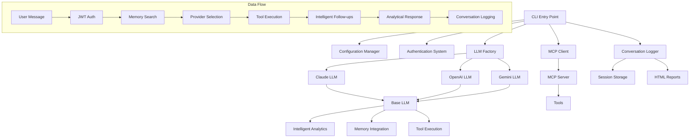

### System Overview

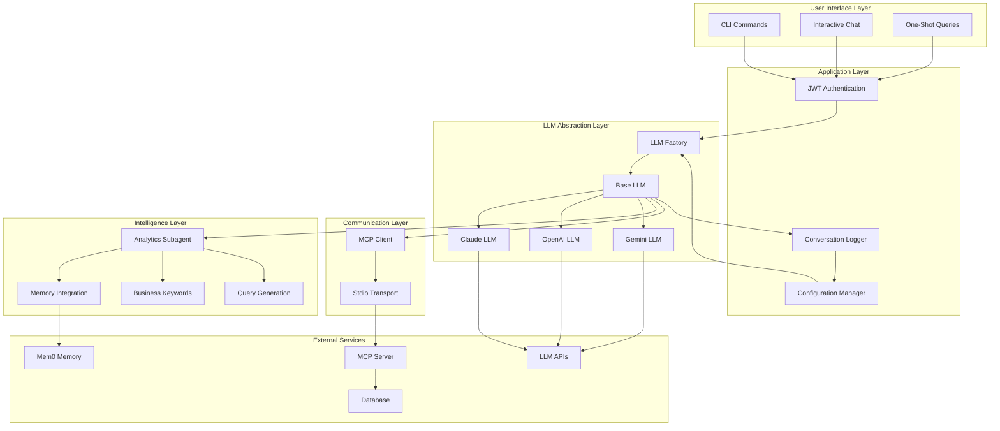

---

## Core Components

### CLI Entry Point (`cli.js`)

The CLI is the primary user interface built with Commander.js, providing multiple interaction modes:

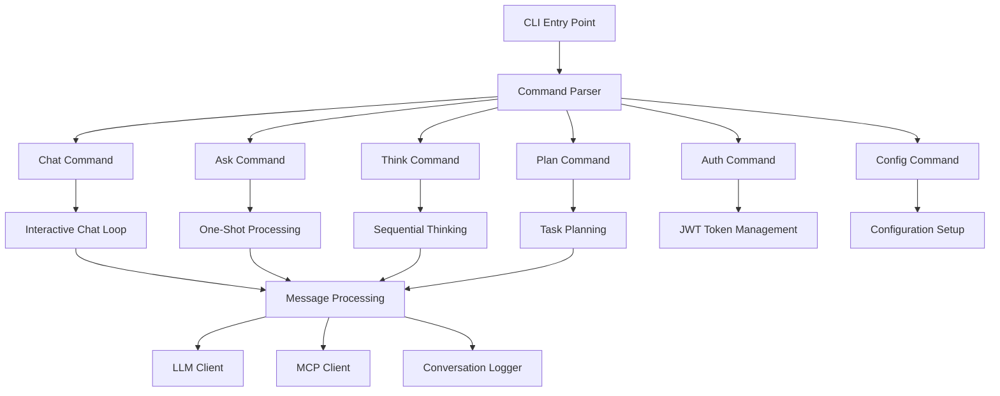

#### Key Features:

1. **Interactive Chat Mode**: Real-time conversation with context preservation
2. **One-Shot Queries**: Direct question-answer without persistent session
3. **Sequential Thinking**: Structured problem analysis
4. **Task Planning**: Objective-based planning with dependencies
5. **Authentication Management**: JWT token setup and validation
6. **Configuration**: Interactive setup and management

#### Command Structure:

```javascript
// Available CLI commands
aden-client chat [-t token]           // Interactive chat
aden-client ask "question" [-t token] // One-shot query
aden-client think "problem" [-t token] // Sequential analysis
aden-client plan "objective" [-t token] // Task planning
aden-client auth [-t token] [-h host] // Authentication
aden-client config                    // Configuration setup
```

### AdenCLI Class Structure

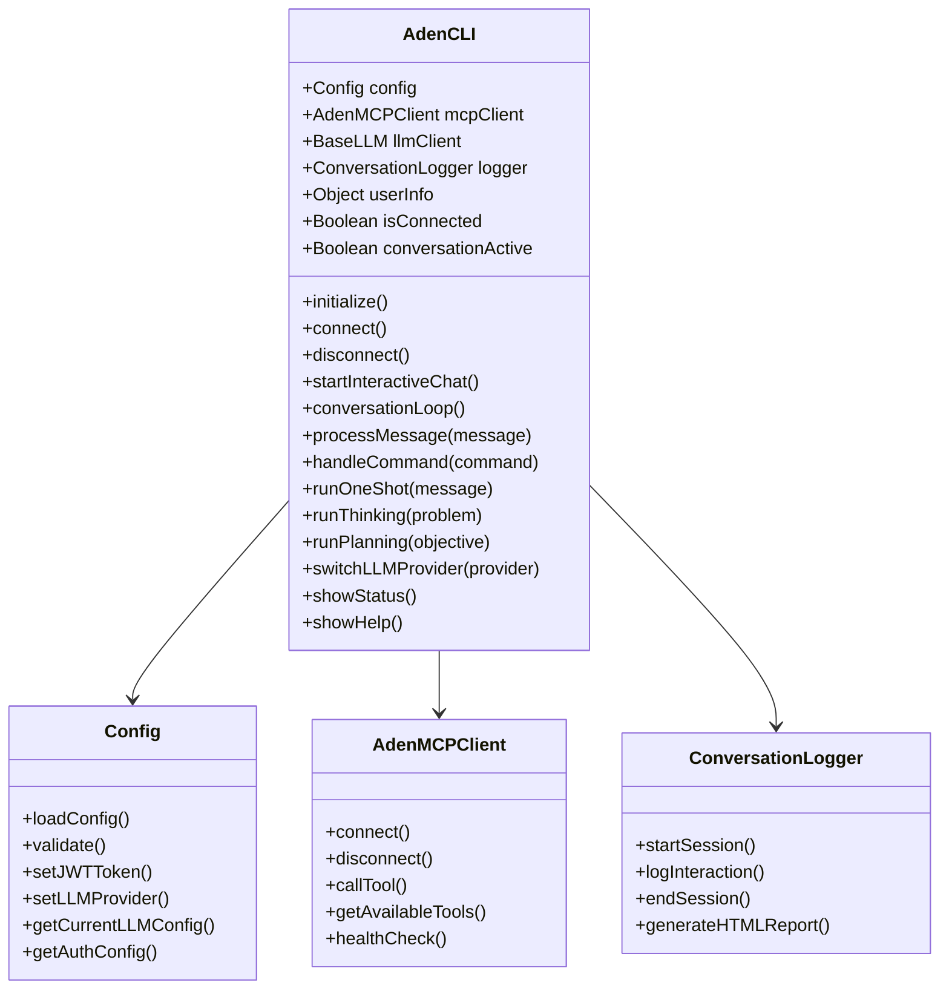

---

## LLM Abstraction Layer

The LLM abstraction layer provides a unified interface for multiple AI providers while maintaining provider-specific optimizations.

### Factory Pattern Implementation

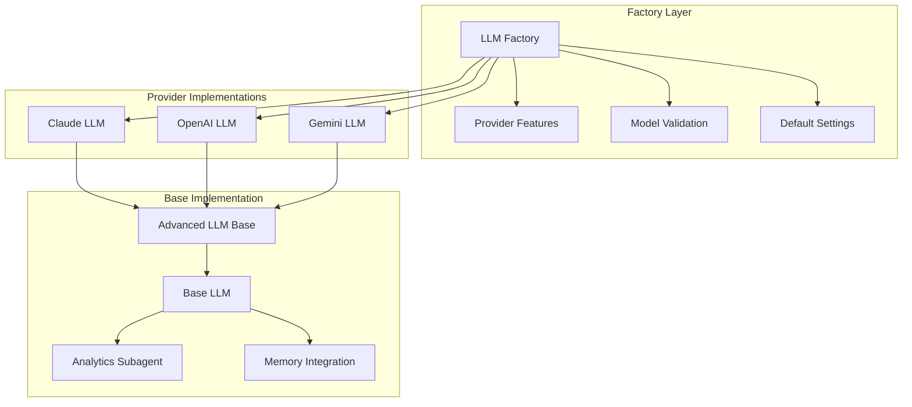

#### LLM Factory (`llm-factory.js`)

The factory manages provider creation with intelligent defaults and validation:

```javascript
class LLMFactory {
    // Provider constants
    static PROVIDERS = {
        CLAUDE: "claude",
        OPENAI: "openai", 
        GEMINI: "gemini"
    };
    
    // Model definitions per provider
    static MODELS = {
        CLAUDE: {
            "claude-3-5-sonnet-20241022": "claude-3-5-sonnet-20241022",
            "claude-3-5-haiku-20241022": "claude-3-5-haiku-20241022",
            // ...
        },
        // ...
    };
    
    // Provider-specific features
    static PROVIDER_FEATURES = {
        CLAUDE: {
            streaming: true,
            functionCalling: true,
            vision: true,
            analyticsSubagent: true,
            businessQueryDetection: true,
            maxContextLength: 200000
        },
        // ...
    };
}
```

#### Provider Selection Flow

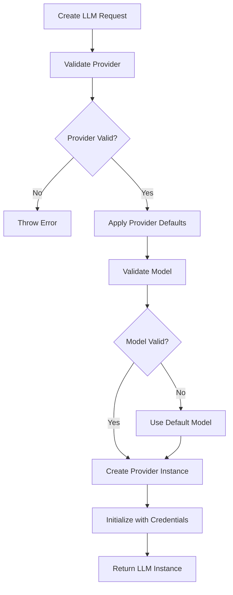

### Base LLM Implementation (`base-llm.js`)

The base LLM class provides sophisticated conversation management with advanced features:

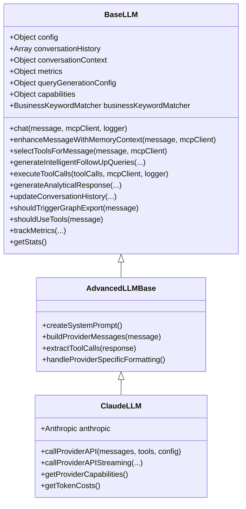

### Conversation Flow

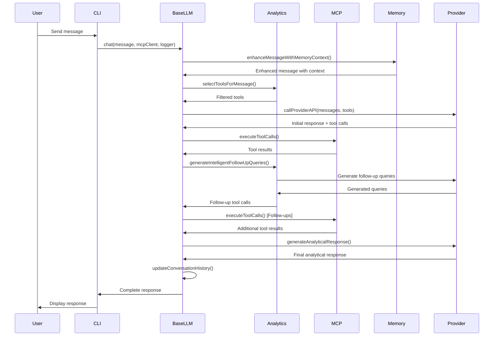

---

## MCP Client System

The MCP (Model Context Protocol) client manages communication with the MCP server for tool execution.

### MCP Client Architecture

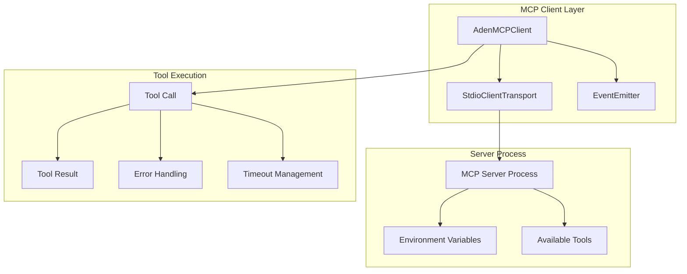

#### Connection Management

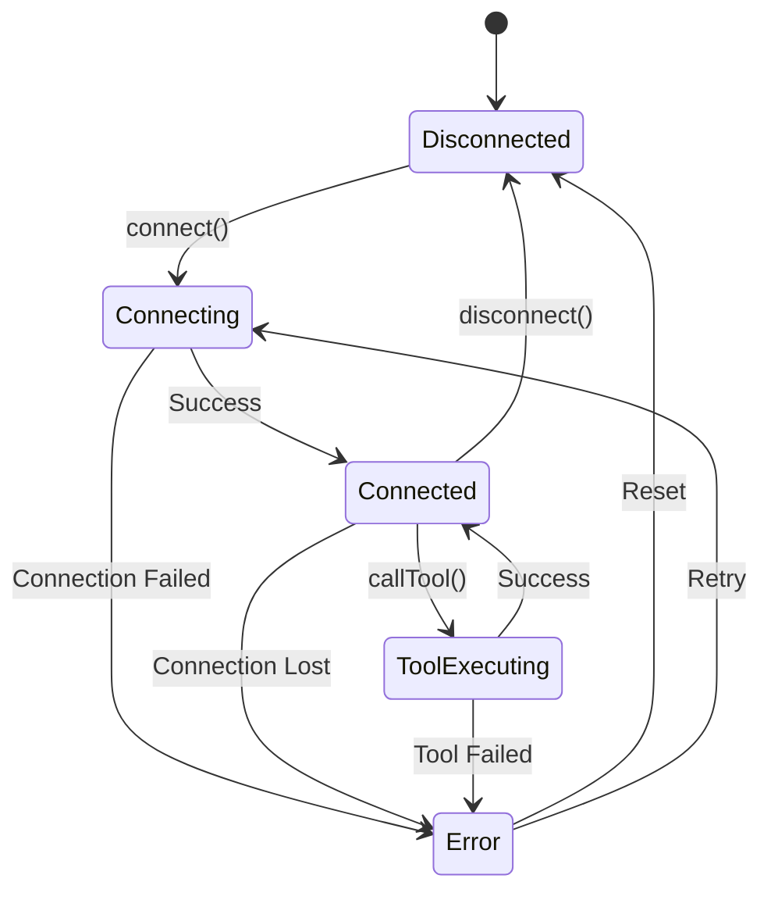

#### AdenMCPClient Implementation

```javascript
class AdenMCPClient extends EventEmitter {
    constructor(serverPath, options = {}) {
        super();
        this.serverPath = serverPath;
        this.jwtToken = options.jwtToken;
        this.teamId = options.teamId;
        this.client = null;
        this.transport = null;
        this.isConnected = false;
        this.availableTools = [];
    }
    
    async connect() {
        // Prepare environment variables
        const serverEnv = { ...process.env };
        if (this.jwtToken) {
            serverEnv.ADEN_API_TOKEN = this.jwtToken;
        }
        if (this.teamId) {
            serverEnv.CURRENT_TEAM_ID = this.teamId;
        }
        
        // Create stdio transport
        this.transport = new StdioClientTransport({
            command: "node",
            args: [this.serverPath],
            env: serverEnv
        });
        
        // Connect client
        this.client = new Client(/* ... */);
        await this.client.connect(this.transport);
        this.isConnected = true;
        
        await this.refreshTools();
        this.emit("connected");
    }
}
```

### Tool Execution Flow

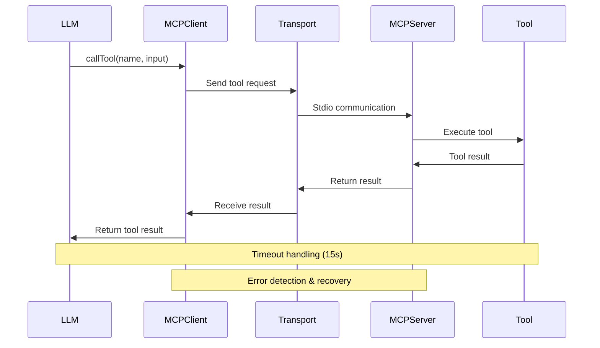

---

## Configuration Management

The configuration system provides flexible, environment-driven settings with validation and interactive setup.

### Configuration Architecture

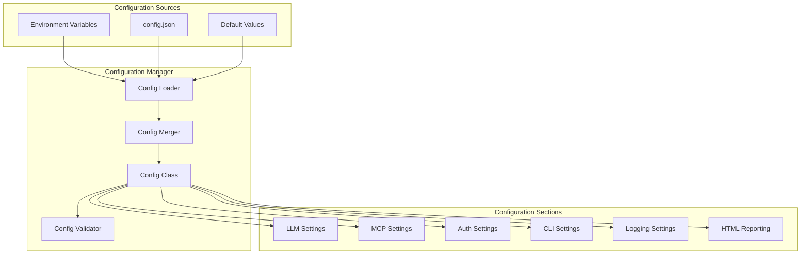

#### Configuration Schema

```javascript
const configSchema = {
    llm: {
        provider: "claude", // 'claude', 'openai', 'gemini'
        claude: {
            apiKey: process.env.ANTHROPIC_API_KEY,
            model: "claude-3-5-sonnet-20241022",
            maxTokens: 4000,
            temperature: 0.7
        },
        openai: {
            apiKey: process.env.OPENAI_API_KEY,
            model: "gpt-4o",
            maxTokens: 4000,
            temperature: 0.7
        },
        gemini: {
            apiKey: process.env.GOOGLE_AI_API_KEY,
            model: "gemini-2.5-pro",
            maxTokens: 8192,
            temperature: 0.7
        }
    },
    mcp: {
        serverPath: "../src/index.js",
        timeout: 60000
    },
    auth: {
        jwtToken: process.env.ADEN_JWT_TOKEN,
        adenHost: "https://your-api-host.com"
    },
    cli: {
        prompt: "aden> ",
        historySize: 100,
        autoSave: true,
        colorOutput: true
    },
    conversationLogging: {
        enabled: true,
        logDir: "./logs",
        maxLogFileSize: 10485760, // 10MB
        maxLogFiles: 50
    },
    htmlReporting: {
        enabled: true,
        outputDir: "./logs/html",
        theme: "modern",
        autoGenerate: true
    }
};
```

### Configuration Validation Flow

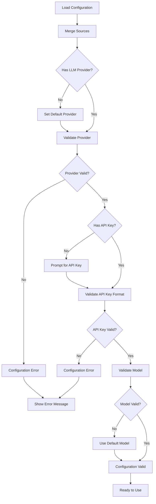

---

## Authentication & Team Management

The authentication system provides JWT-based team authentication with automatic token parsing and team ID extraction.

### Authentication Flow

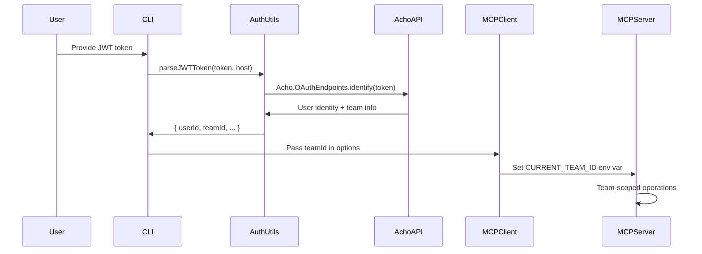

#### JWT Token Structure

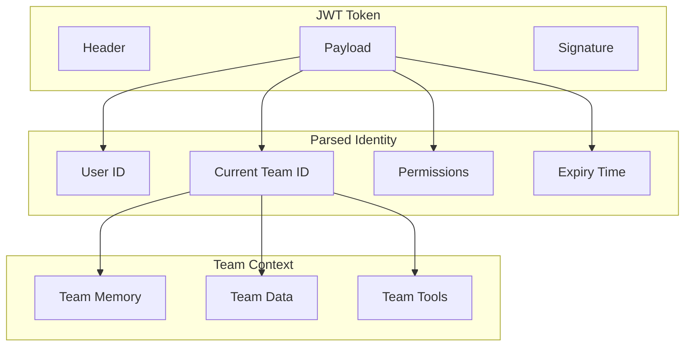

#### Authentication Commands

```bash
# Interactive authentication setup
aden-client auth

# Direct token setup
aden-client auth -t "eyJ0eXAiOiJKV1QiLCJhbGciOiJIUzI1NiJ9..."

# Custom host setup
aden-client auth -t "token" -h "https://custom-host.com"
```

### Team Data Isolation

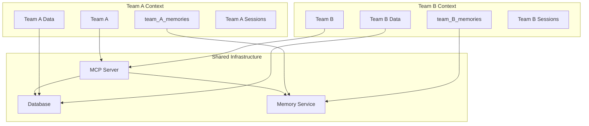

---

## Intelligent Analytics Subagent

The analytics subagent is a sophisticated system that automatically detects business queries and generates intelligent follow-up database queries.

### Analytics Architecture

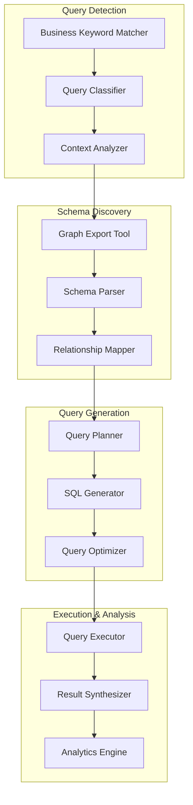

### Business Query Detection

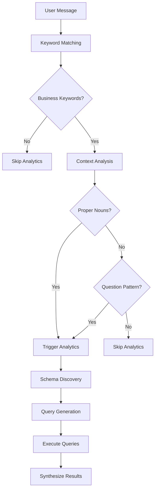

#### Business Keyword Matcher

```javascript
class BusinessKeywordMatcher {
    constructor(config = {}) {
        this.keywords = {
            business: ['revenue', 'profit', 'sales', 'customer', 'deal', 'contract'],
            data: ['show', 'find', 'search', 'get', 'display', 'list'],
            analytics: ['analyze', 'trend', 'performance', 'metrics', 'statistics'],
            entities: ['engagement', 'lead', 'opportunity', 'account', 'project']
        };
        
        this.config = {
            threshold: config.threshold || 0.6,
            exactWeight: config.exactWeight || 0.4,
            distanceWeight: config.distanceWeight || 0.3,
            jaccardWeight: config.jaccardWeight || 0.2,
            substringWeight: config.substringWeight || 0.1
        };
    }
    
    getMatchDetails(text) {
        // Multi-layer matching algorithm
        const exactMatches = this.findExactMatches(text);
        const fuzzyMatches = this.findFuzzyMatches(text);
        const semanticMatches = this.findSemanticMatches(text);
        
        return {
            hasMatches: exactMatches.length > 0 || fuzzyMatches.length > 0,
            exactMatches,
            fuzzyMatches,
            semanticMatches,
            confidence: this.calculateConfidence(exactMatches, fuzzyMatches)
        };
    }
}
```

### Query Generation Pipeline

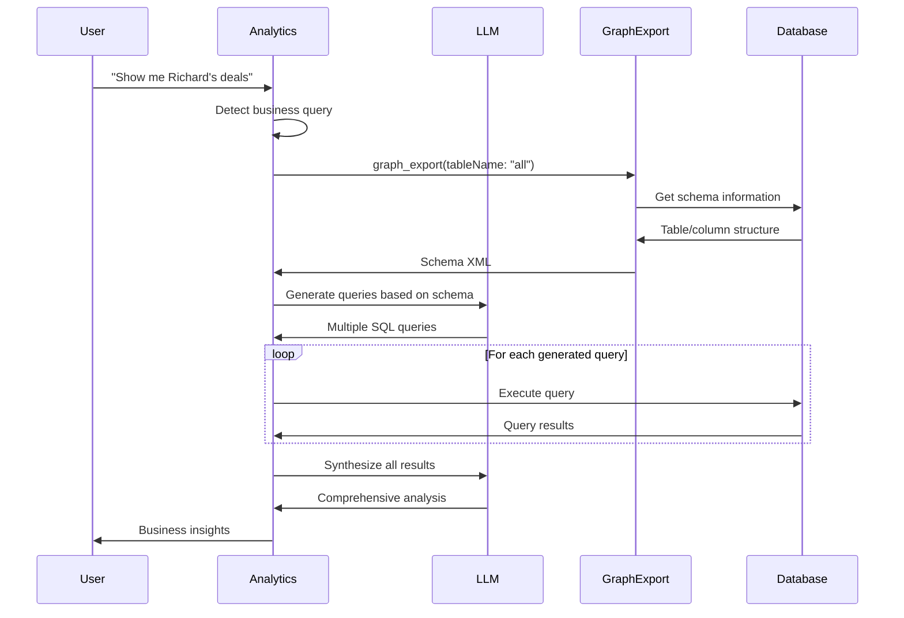

#### Multi-Query Strategy

The system generates 8-15 follow-up queries covering multiple dimensions:

```javascript
const queryDimensions = {
    PRIMARY_DATA: "Direct answer to user's question",
    CONTEXTUAL_DATA: "Related information for context",
    SUMMARY_DATA: "Aggregated insights and totals",
    COMPARATIVE_DATA: "Trends, comparisons, benchmarks",
    RELATIONSHIP_DATA: "Connected entities and associations",
    HISTORICAL_DATA: "Time-series data and trends",
    DETAIL_DATA: "Granular information for analysis",
    RELATED_ENTITIES: "Associated records and connections"
};
```

### Query Generation Example

For a query like "Show me Richard's deals":

```mermaid
graph TD
    A[User Query: "Show me Richard's deals"] --> B[Schema Discovery]
    B --> C[Generate Multiple Queries]
    
    C --> D[Primary Query: Find Richard's deals]
    C --> E[Context Query: Richard's profile]
    C --> F[Summary Query: Deal totals]
    C --> G[Historical Query: Deal timeline]
    C --> H[Related Query: Associated contacts]
    C --> I[Performance Query: Deal metrics]
    C --> J[Comparative Query: vs other deals]
    C --> K[Detail Query: Deal specifics]
    
    D --> L[Execute All Queries]
    E --> L
    F --> L
    G --> L
    H --> L
    I --> L
    J --> L
    K --> L
    
    L --> M[Synthesize Results]
    M --> N[Generate Business Insights]
```

---

## Memory Integration

The memory system provides team-scoped, cross-session context retention using Mem0 integration.

### Memory Architecture

```mermaid
graph TB
    subgraph "Memory Interface"
        SearchMemories[search_memories Tool]
        Remember[remember Tool]
        MemoryManager[Memory Manager]
    end
    
    subgraph "Memory Storage"
        Mem0[Mem0 Service]
        TeamAgent[Team Agent]
        SessionData[Session Data]
    end
    
    subgraph "Memory Categories"
        Decisions[Business Decisions]
        Preferences[User Preferences]
        Facts[Confirmed Facts]
        Insights[Technical Insights]
    end
    
    subgraph "Context Integration"
        ConversationHistory[Conversation History]
        TeamContext[Team Context]
        ProjectContext[Project Context]
    end
    
    SearchMemories --> MemoryManager
    Remember --> MemoryManager
    MemoryManager --> Mem0
    
    Mem0 --> TeamAgent
    TeamAgent --> SessionData
    
    MemoryManager --> Decisions
    MemoryManager --> Preferences
    MemoryManager --> Facts
    MemoryManager --> Insights
    
    TeamAgent --> ConversationHistory
    TeamAgent --> TeamContext
    TeamAgent --> ProjectContext
```

### Memory Flow

```mermaid
sequenceDiagram
    participant User
    participant LLM
    participant Memory
    participant Mem0
    participant TeamAgent
    
    User->>LLM: Ask question
    LLM->>Memory: search_memories(query, teamId)
    Memory->>Mem0: Search team memories
    Mem0->>TeamAgent: Query team_{teamId} agent
    TeamAgent->>Memory: Relevant memories
    Memory->>LLM: Context from previous conversations
    
    LLM->>User: Response with context
    
    Note over LLM: If explicit decision made
    LLM->>Memory: remember(content, category, confidence)
    Memory->>Mem0: Store in team memory
    Mem0->>TeamAgent: Update team_{teamId} agent
```

#### Memory Usage Guidelines

```javascript
// CRITICAL: Always search memories first
const response = await llm.chat(message, mcpClient);

// Memory search pattern
async function enhanceMessageWithMemoryContext(message, mcpClient) {
    // Search team memories for relevant context
    const memoryResults = await mcpClient.callTool('search_memories', {
        sessionId: this.sessionId,
        query: extractKeywords(message),
        teamId: this.teamId,
        limit: 5
    });
    
    // Use memory context to enhance response
    return this.incorporateMemoryContext(message, memoryResults);
}
```

### Memory Categories

```mermaid
graph TD
    subgraph "Memory Categories"
        A[explicit_decision]
        B[stated_preference]
        C[confirmed_fact]
        D[technical_insight]
        E[business_context]
    end
    
    subgraph "Confidence Levels"
        F[0.9+ Explicit statements]
        G[0.7-0.9 Confirmed facts]
        H[0.5-0.7 Inferred insights]
        I[0.3-0.5 Tentative info]
    end
    
    subgraph "Storage Rules"
        J[Only explicit user statements]
        K[Never store analysis]
        L[Never store assumptions]
        M[Team-scoped isolation]
    end
    
    A --> F
    B --> F
    C --> G
    D --> H
    E --> H
    
    F --> J
    G --> J
    H --> L
    I --> L
    
    J --> M
    K --> M
    L --> M
```

---

## Logging & Reporting

The logging system provides comprehensive audit trails with HTML report generation.

### Logging Architecture

```mermaid
graph TB
    subgraph "Logging Sources"
        Interactions[User Interactions]
        ToolCalls[Tool Calls]
        APIRequests[API Requests]
        Errors[Errors & Exceptions]
    end
    
    subgraph "Logging System"
        Logger[Conversation Logger]
        SessionManager[Session Manager]
        StorageManager[Storage Manager]
    end
    
    subgraph "Storage"
        JSONLogs[JSON Log Files]
        SessionDB[Session Database]
        MetricsDB[Metrics Database]
    end
    
    subgraph "Reporting"
        HTMLReports[HTML Reports]
        StatsDashboard[Statistics Dashboard]
        AnalyticsReports[Analytics Reports]
    end
    
    Interactions --> Logger
    ToolCalls --> Logger
    APIRequests --> Logger
    Errors --> Logger
    
    Logger --> SessionManager
    SessionManager --> StorageManager
    
    StorageManager --> JSONLogs
    StorageManager --> SessionDB
    StorageManager --> MetricsDB
    
    StorageManager --> HTMLReports
    StorageManager --> StatsDashboard
    StorageManager --> AnalyticsReports
```

### Session Logging Flow

```mermaid
sequenceDiagram
    participant CLI
    participant Logger
    participant Storage
    participant HTMLRenderer
    
    CLI->>Logger: startSession(metadata)
    Logger->>Storage: Create session record
    
    loop For each interaction
        CLI->>Logger: logInteraction(message, response, tools)
        Logger->>Storage: Append interaction data
        Logger->>Logger: Update session statistics
    end
    
    CLI->>Logger: endSession()
    Logger->>Storage: Finalize session record
    Logger->>HTMLRenderer: Generate HTML report
    HTMLRenderer->>Storage: Save HTML file
```

#### Logging Configuration

```javascript
const loggingConfig = {
    conversationLogging: {
        enabled: true,
        logDir: "./logs",
        maxLogFileSize: 10485760, // 10MB
        maxLogFiles: 50,
        logToolCalls: true,
        logRawPrompts: true,
        logResponses: true
    },
    htmlReporting: {
        enabled: true,
        outputDir: "./logs/html",
        theme: "modern",
        autoGenerate: true,
        includeRawPrompts: true,
        includeToolDetails: true,
        autoOpen: false
    }
};
```

### HTML Report Generation

```mermaid
flowchart TD
    A[Session Data] --> B[Template Engine]
    B --> C[HTML Template]
    C --> D[CSS Styling]
    D --> E[JavaScript Interactivity]
    E --> F[Generate Report]
    
    subgraph "Report Sections"
        G[Session Overview]
        H[Conversation Timeline]
        I[Tool Usage Analysis]
        J[Performance Metrics]
        K[Error Analysis]
    end
    
    F --> G
    F --> H
    F --> I
    F --> J
    F --> K
    
    G --> L[Final HTML Report]
    H --> L
    I --> L
    J --> L
    K --> L
```

---

## Usage Examples

### Basic Usage

```bash
# Start interactive chat
aden-client chat

# Ask a one-time question
aden-client ask "Show me our latest deals"

# Authenticated session
aden-client chat -t "your_jwt_token"

# Sequential thinking
aden-client think "How to improve customer retention"

# Task planning
aden-client plan "Implement new dashboard"
```

### Advanced Usage

```bash
# Setup authentication
aden-client auth -t "token" -h "https://your-host.com"

# Configure client
aden-client config

# Switch LLM provider
/switch gemini

# Generate HTML reports
aden-client html --all

# View conversation statistics
aden-client logs --stats
```

### Programming Examples

```javascript
// Initialize CLI with custom configuration
const cli = new AdenCLI();
cli.config.setLLMProvider('claude');
cli.config.setJWTToken('your_token');
await cli.initialize();

// Start chat session
await cli.startInteractiveChat();

// One-shot query
await cli.runOneShot('Analyze Q4 performance');

// Switch providers programmatically
await cli.switchLLMProvider('openai');
```

---

## API Reference

### Core Classes

#### AdenCLI
Main CLI controller class.

```javascript
class AdenCLI {
    constructor()
    async initialize()
    async connect()
    async disconnect()
    async startInteractiveChat()
    async processMessage(message)
    async runOneShot(message)
    async runThinking(problem)
    async runPlanning(objective)
    async switchLLMProvider(provider)
}
```

#### LLMFactory
Factory for creating LLM instances.

```javascript
class LLMFactory {
    static async create(provider, config, credentials)
    static getAvailableModels(provider)
    static getSupportedProviders()
    static isValidModel(provider, model)
    static getDefaultModel(provider)
    static recommendProviderForTask(taskType, requirements)
}
```

#### BaseLLM
Base class for all LLM implementations.

```javascript
class BaseLLM {
    async chat(message, mcpClient, logger)
    async enhanceMessageWithMemoryContext(message, mcpClient)
    async generateIntelligentFollowUpQueries(...)
    async executeToolCalls(toolCalls, mcpClient, logger)
    shouldTriggerGraphExport(message)
    shouldUseTools(message)
    getStats()
    trackMetrics(responseTime, tokensUsed, hasError, toolCalls)
}
```

#### AdenMCPClient
MCP client for tool execution.

```javascript
class AdenMCPClient extends EventEmitter {
    constructor(serverPath, options)
    async connect()
    async disconnect()
    async callTool(name, input)
    async refreshTools()
    getAvailableTools()
    async healthCheck()
}
```

#### Config
Configuration management.

```javascript
class Config {
    constructor()
    loadConfig()
    validate()
    setJWTToken(token)
    setLLMProvider(provider)
    getCurrentLLMConfig()
    getAuthConfig()
    getMCPConfig()
}
```

### Tool Integration

#### Memory Tools
```javascript
// Search team memories
await mcpClient.callTool('search_memories', {
    sessionId: 'current_session',
    query: 'project timeline',
    teamId: 'team123',
    limit: 5
});

// Store important information
await mcpClient.callTool('remember', {
    sessionId: 'current_session',
    content: 'Project deadline moved to March 15th',
    category: 'explicit_decision',
    confidence: 0.95
});
```

#### Database Tools
```javascript
// Execute database query
await mcpClient.callTool('db_query', {
    query: 'SELECT * FROM deals WHERE status = $1',
    params: ['active'],
    limit: null
});

// Export database schema
await mcpClient.callTool('graph_export', {
    tableName: 'all',
    depth: 1,
    format: 'xml'
});
```

#### Visualization Tools
```javascript
// Create Mermaid diagram
await mcpClient.callTool('mermaid_diagram', {
    title: 'Process Flow',
    content: 'flowchart TD\n    A[Start] --> B[Process] --> C[End]'
});

// Generate data visualization
await mcpClient.callTool('vega_lite_diagram', {
    title: 'Sales Trends',
    data: salesData,
    mark: 'line',
    encoding: { x: 'date', y: 'sales' }
});
```

---

This comprehensive documentation provides a complete guide to understanding and using the Aden MCP Client Framework. The modular architecture, sophisticated LLM integration, and team-based features make it a powerful tool for enterprise conversational AI applications.